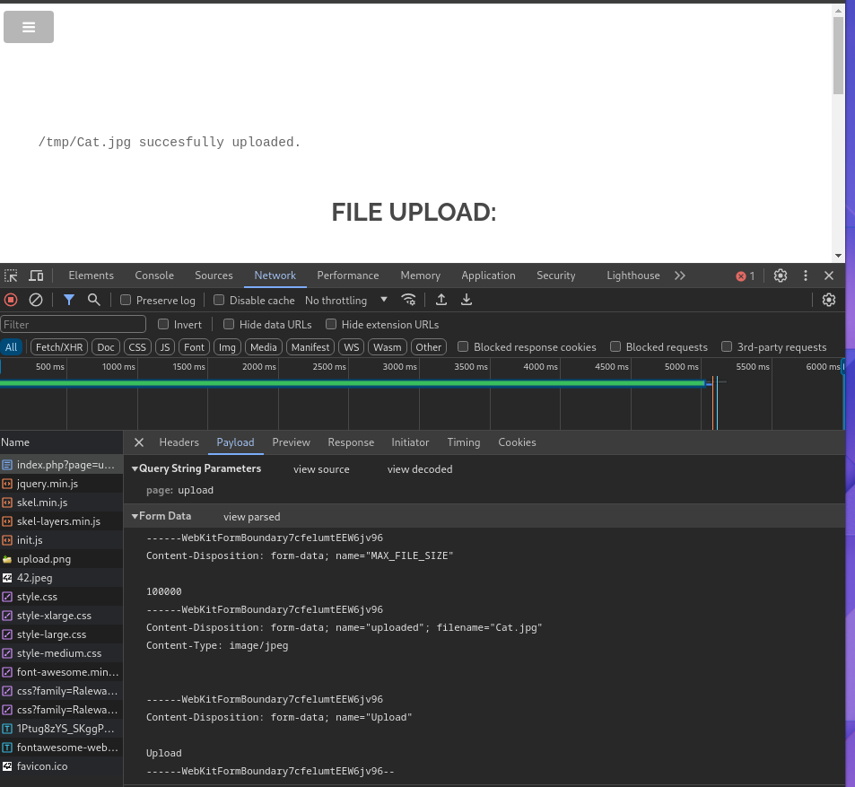
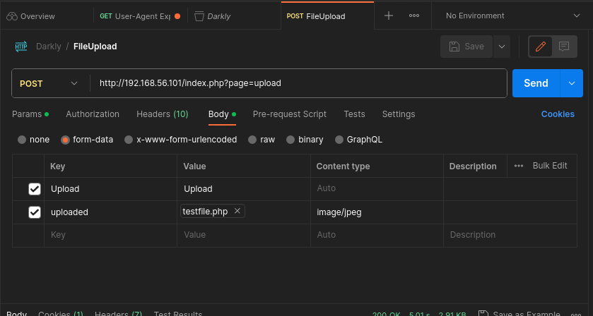

# File Upload

## simple jpg image upload
At http://192.168.56.101/index.php?page=upload, you can upload JPG image files.

## .php file upload
However, uploading .php files is not permitted.

## To resolve
To bypass this, we can disguise a .php file as a JPG image by spoofing the MimeType, allowing us to successfully upload the file and capture the flag.
We use Postman to send the PHP file via a POST request.

During this process, modify the Body's form-data as follows:

- For "Upload", the value should be "Upload".
- For "uploaded", choose the PHP file to upload and specify the content type as image/jpg.