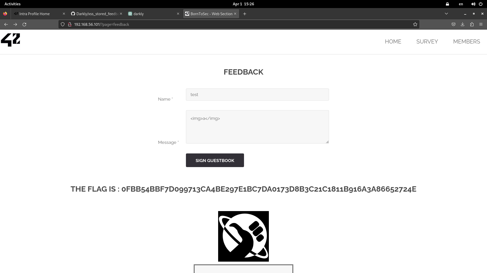

- Cross-Site Scripting (XSS)
    - HTML contents can be inputted in input
    - execute users input without checking contents


In feedback Page ``` http://192.168.56.101/?page=feedback ```



### XSS攻撃（クロスサイトスクリプティング攻撃）とは
悪意のあるスクリプトをWebページに注入し、他のユーザーのブラウザ上でそのスクリプトを実行させることによって、ユーザーの情報を盗んだり、ユーザーに代わって行動したりする攻撃手法


##### 格納型XSS
攻撃者が悪意のあるスクリプトをWebアプリケーションのデータベースに保存する。
その後、他のユーザーがそのスクリプトが保存されたページを訪れると、スクリプトが自動的に実行される形になる。
-> このタイプの攻撃はフォーラムの投稿やコメント欄など、ユーザーの入力が他のユーザーに表示される場所でよく見られる。